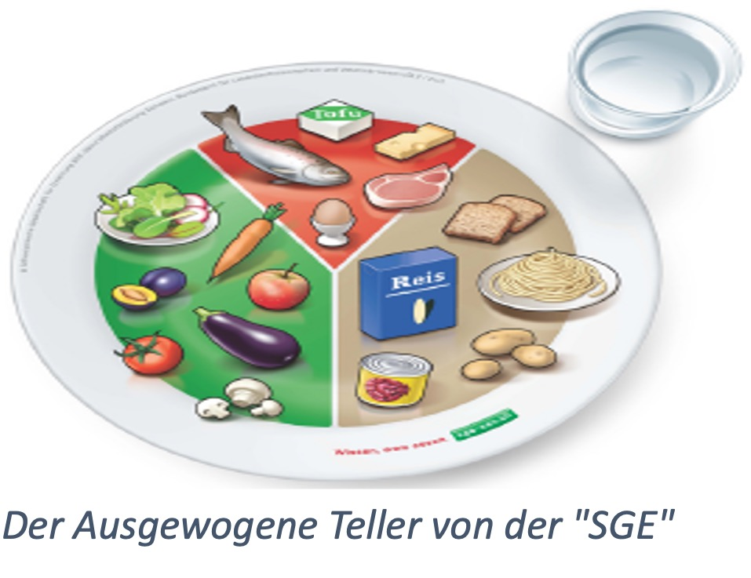

+++
title = "Reportage Ernährung der Schüler*innen am Gymnasium Kirchenfeld"
date = "2024-06-11"
draft = false
pinned = false
+++
# Ernährung der Jugend

## Ernährt sich die Jugend heutzutage gesund und ausgewogen?

Lautes Kassenklingeln und Stimmen, die durcheinanderreden. Viele Schülerinnen und Schüler des Gymnasiums Kirchenfeld gehen in der Migros Filiale an der Luisenstrasse am Mittag ein und aus. Vor den Regalen herrscht ein dichtes Gedränge. Ein M-Budget Poulet Sandwich hier, drei Donuts da. Die Gemüse- und Früchteabteilung so gut wie unberührt. Das Einzige, was noch Frucht in sich hat, ist das Capri Sun, welches von einem Schüler eingesteckt wird. Zurück im Gymnasium laufen wir durch die Gänge auf der Suche nach einem freien Tisch. Viele sind schon besetzt und grösstenteils voll mit Fertiggerichten und Fast Food. Gemüse, pflanzliche Eiweisse und gesunde Fette sucht man vergeblich. Wenn man seinen Abfall entsorgen will, wird man von Abfalleimern, die bis zum Rand mit Plastikverpackungen vollgestopft sind, begrüsst. Dieses Spiel wiederholt sich von Tag zu Tag und man muss sich fragen: Ernähren sich Jugendliche überhaupt gesund und ausgewogen?

## Die Expertise der Ernährungsberatung

Wir wollen die Meinung zu dieser Frage hören. Also gehen wir an einem regnerischen Tag in das Beau-Site Krankenhaus in der Nähe des Viktoria Platzes. Nachdem wir zuerst mit dem Tram daran vorbeigefahren sind, schreiten wir in Richtung des Klinikums und es beginnt zu stürmen. An der Rezeption empfängt uns Frau Negri und wir folgen ihr in den langen, wirren, mit grossen Fenstern ausgekleideten Gängen. Als wir das Gebäude des Sitzungszimmers betreten, riecht es nach frisch gekochtem Mittagessen. Denn ein Stockwerk unter dem Sprechzimmer ist die Küche, welche das Essen für Patienten und Gäste zubereitet. Im Sprechzimmer, welches dazu noch die Küche der Mitarbeiter und Mitarbeiterinnen Frau Negris ist, führen wir unser Interview. 
Wir möchten möglichst viel über dieses komplizierte und in sich komplexe Thema in Erfahrung bringen und so fragen wir, ob sie der Meinung sei, dass sich Jugendliche heutzutage nicht ausgewogen ernähren. Die Antwort auf diese Frage finden wir zugegebenermassen schockierend. Frau Negri meint, dass nicht nur die Problematik von übermässigem Fastfood Konsum heutzutage zum Vorschein tritt, sondern auch scheinbar gesunde Ernährungstrends. Nicht alle Probleme liegen ihrer Meinung nach im Verzehr von Fastfood, sondern auch in den gesunden Ernährungsweisen, welche Trends auf z.B. TikTok zeigen. Sie verweist auf ein Kurzvideo, welches sie selbst auf der sozialen Medien Plattform TikTok gesehen hat. Eine sogenannte Gurkendiät wird als «gesund», und «reinigend» beschrieben. Doch was dabei das Problem ist, zeigt sie uns mithilfe einer Abbildung von der Schweizer Gesellschaft für Ernährung «SGE». 

Auf der Grafik ist ein Teller abgebildet, welcher zu weniger als 50% mit Gemüse und Früchten belegt ist. Dabei sollte man auf grünes Blattgemüse zielen, aber auch Gurken, Tomaten, Karotten, Zucchini und Pilze. Ein Früchteanteil darf auf dem Teller nicht fehlen. Dazu sollte man zwischen Äpfel, Trauben, Birnen oder Erdbeeren wählen.  Exotische Varianten sind eine gesunde Alternative. Wichtig ist hierbei vor allem, dass man 3 Portionen à 120 g Gemüse und 2 Portionen à 120 g Früchte pro Tag zu sich nimmt. Dasselbe gilt für Kohlenhydrate wie z.B. Reis, Teigwaren, Kartoffeln oder Brot.  Dabei beträgt die tägliche Menge jedoch 4-6 Portionen à 120 g. Für Milchprodukte, Fleisch, Fisch, Eier oder Tofu gelten täglich 3 Portionen.
1 Portion entspricht 2 dl Milch oder 150–200g Joghurt, Quark, Hüttenkäse oder 30 g Käse.

> **«Meiner Meinung nach, ist nicht nur der übermässige Konsum von Fastfood das Problem, sondern auch scheinbar gesunde Ernährungstrends in den sozialen Medien»**

Claudio Negri 
Ernährungsberaterin Beau-Site 

Frau Negri erklärt uns, dass eine Diät, welche vielleicht von manchen als «gesund und ausgewogen» angepriesen wird, nicht einem optimalen Teller entspricht. Wir schliessen aus dieser Antwort, dass zu einer ausgewogenen Hauptmahlzeit (Frühstück,
Mittagessen, Abendessen) immer folgende vier Komponenten gehören:

* ein ungesüsstes Getränk
* Gemüse /Salat / Früchte
* ein stärkereiches Lebensmittel
* ein proteinreiches Lebensmittel

Da wir nun dank Frau Negri wissen, wie ein ausgewogenes Mittagessen aussehen sollte, gleichen wir dies mit unseren Beobachtungen aus dem Migros und dem Gymnasium ab. Wir kommen zur besorgniserregenden Erkenntnis, dass die meisten Gerichte der Schülerinnen und Schüler überhaupt nicht dieser Grafik entsprechen. Man könnte nun denken, dass ein M-Budget Poulet Sandwich wenigsten stärkt und sicherlich proteinreich ist. Denn es ist wohl überall bekannt, dass Geflügel proteinreich ist. 

Bas Kast, der Autor des Buches «Der Ernährungskompass», sagt in seinem Buch zuerst, dass wenn man längere Zeit auf Proteine verzichtet, man schlicht stirbt. Proteine sind die Baustoffe des Körpers wie bei einem Haus Beton, Holz oder Stahl und ohne kann gar nichts gebaut oder instandgehalten werden. 

Ist man also mit einem M-Budget Poulet Sandwich auf der sicheren Seite punkto Proteine? 

Nein, definitiv nicht. Bas Kast sagt ebenfalls, dass die heutige Lebensmittelindustrie die Proteine verdünnt. Das heisst, die Produkte, die eigentlich reich an Proteinen sind, werden durch Zucker und Fette verdünnt. Es riecht und schmeckt noch nach Eiweiss und der Körper hat auch das Gefühl er futtert reichlich davon, aber in Realität ist davon nicht so viel vorhanden. Kurz gesagt, unsere Instinkte werden ausgetrickst. Somit lautet der Tipp von Bas Kast: «Verzichten Sie auf jede Form von Industrie-Food». Dazu gehört demnach auch unser M-Budget Poulet Sandwich. Wir können stark davon ausgehen, dass die Proteine darin verdünnt sind. Also doch keine gute Option. Denken wir noch einmal an die Migros Filiale mit den vollen Regalen an Lebensmitteln zurück. Der Grossteil davon ist Industrie-Food und in seinen Nährstoffen verdünnt. Wir kommen zum Schluss, dass ein in der Migros zusammengestelltes Mittagessen wohl nicht die gesündeste Option ist. Doch wo dann?

Das wohlvertraute Läuten der Klingel ertönt und kündigt den Beginn eines weiteren Mittags an. Anstatt den Weg in die Migros Filiale auf sich zu nehmen, verlässt man das Schulgebäude auf der anderen Seite und geht durch die glasige Doppeltüre in die Mensa. Auch dort herrschen laute Stimmen in der Schlange vor der Essensausgabe und die Gerüche der verschiedenen Menüs steigen einem in die Nase. Claudio Dini, der Mensaleiter, begrüsst einem freundlich und fragt welches Menü man haben möchte. Mit einem ausgewogenen Teller mit Proteinen, Kohlenhydraten und gesunden Fetten sucht man sich einen Tisch. Wird der Teller leer gegessen, kann man sich noch einmal in die Schlange stellen und eine zweite Portion der Beilagen Gemüse, Kartoffeln, Reis oder was gerade auf dem Menüplan steht, holen damit man auch satt wird.

## Der Beitrag der Mensa

In einem Gespräch erzählt uns Claudio Dini, was er und das ganze Team der Mensa für die Ernährung der Schülerinnen und Schüler des Gymnasiums tun. Auf die Eröffnungsfrage, wie viele Menüs pro Tag verkauft werden und ob er mit dieser Zahl zufrieden sei, antwortet er, etwa 130 Menüs. Dies sei aber auch tagesabhängig. Zufrieden sei er, mit einem Lächeln fügt er jedoch hinzu, über mehr Schülerinnen und Schüler würde er sich natürlich freuen. Wir erklären ihm von unseren Beobachtungen in der Migros und von unseren Bedenken über die Ernährung der Schülerinnen und Schüler hier am Gymnasium. Er nickt und sagt, er verstehe das. Ihm sei es bewusst, dass viele Schülerinnen und Schüler auf ihr Geld achten müssen. Er finde es aber schade, dass die Ernährung darunter leide. Er würde sehr gerne für alle kochen und ihnen ein gesundes Mittagessen bereitstellen. An den Preisen könne er leider nichts machen. Wir erzählen, dass wir von Schülerinnen und Schüler gehört haben, dass die Portionengrösse ein weiterer Grund sei, dass sie nicht in der Mensa essen. Sie fänden die Portionen zu klein und würden davon nicht satt werden. Hier erzählt uns Claudio Dini von der Möglichkeit, sich einen zweiten Teller Beilagen zu holen. Davon wissen die meisten Schülerinnen und Schüler jedoch nichts. Er fügt hinzu, dass wer in seiner Mensa esse, auch satt wieder in den Unterricht gehe. Wir kommen auf seine Aussage mit dem gesunden Mittagessen zurück und fragen ihn, wie die Mensa auf ein umweltfreundliches und ausgewogenes Angebot achtet, wie es auf ihrer Webseite geschrieben ist. Eine wichtige Frage, denn uns liegt vor allem die gesunde Ernährung der Schülerinnen und Schüler am Herzen. Claudio Dini bestätigt unsere Aussage, da sei er gleicher Meinung. Der «MNI», Menü-Nachhaltigkeits-Index, sei der Schlüssel zum gesunden Angebot der Mensa, welches auch der Umwelt zugutekomme. Er erklärt uns, dass der sogenannte «MNI» berechnet, wie gut das Menu für einen selbst und wie gut es für die Umwelt ist.
Nach dem Gespräch haben wir recherchiert, um noch mehr über diesen «MNI» herauszufinden. Dieser Index wurde von der Zürcher Hochschule für Angewandte Wissenschaften in Zusammenarbeit mit dem ZFV, dem Unternehmen, welchem die Mensa gehört, entwickelt. Einfach gesagt, ist der «MNI» ein Bewertungssystem, welches anhand von einer Vielzahl an Kriterien sagt, ob ein Gericht umweltfreundlich und ausgewogen ist. Mit zwei Symbolen im Menüplan einer Erde (umweltfreundlich) und einem Herz (ausgewogen) werden diese Faktoren angezeigt. Wir schauen uns den Menüplan der Mensa an und tatsächlich, hinter allen Menüs sind eines, wenn nicht sogar beide dieser Symbole zu finden. 

> **«Der MNI ist der Schlüssel zu unserem vielfältigen, gesunden und umweltfreundlichen Angebot»** 

Claudio Dini

 Im Vergleich zu der Migros hat die Mensa demnach nicht nur ausgewogene Menüs zu bieten, welche auch satt machen, sondern auch solche die der Umwelt zugutekommen. Weiter sind die Gerichte der Mensa so gut wie unberührt von der industriellen Nährstoffverdünnung. Lediglich der Preis wäre ein Gegenargument. Schlussendlich muss man sich jedoch die Frage stellen: Welcher Preis hat eine Ernährung, welche zu einem gesunden Leben führt?

Wir persönlich sind bereit diesen Preis zu bezahlen, da uns unsere Gesundheit am Herzen liegt. Doch nicht nur unsere Gesundheit ist uns wichtig, sondern auch die von unseren Mitschülern und Mitschülerinnen. Deshalb auch unsere Bitte an diese: Überlegt doch zweimal, ob ihr in die Migros geht und euch ein M-Budget Poulet Sandwich kauft oder doch ein gesundes, ausgewogenes und umweltfreundliches Menü aus der Mensa kauft.